# *Puckdrop*
> NHL rosters, games, chat, standings, and stats

- League & Division standings
- Team performance, ranking, and rosters
- League-wide chat for all
- Team chat (restricted to fans only!)
- Player performance statistics & biographical information
- Game schedule explorer
- Live box score updates

---

## Screens

### Login/Signup
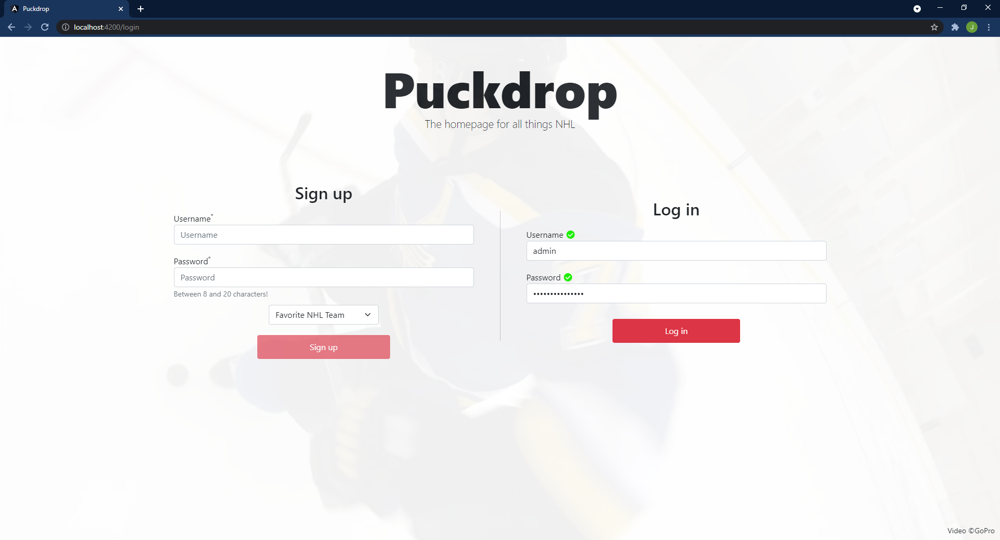

### League Standings
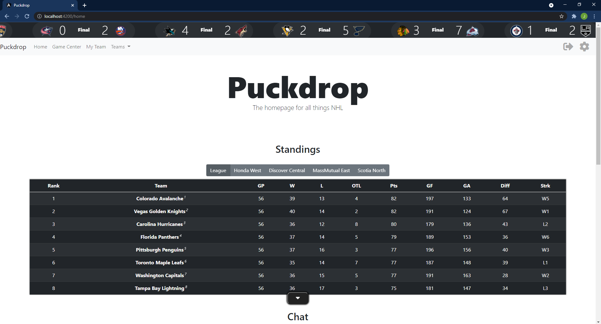

### League Chat
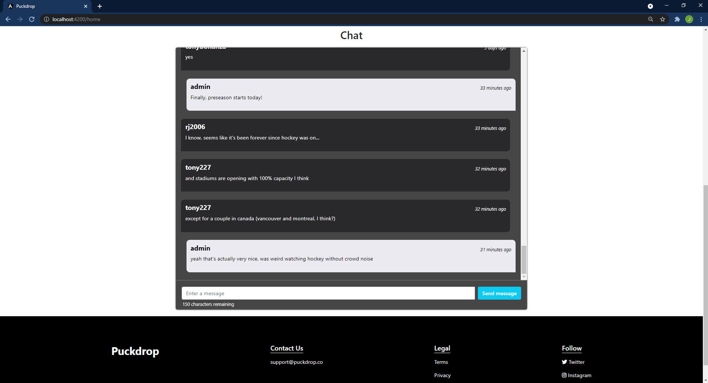

### Game Center
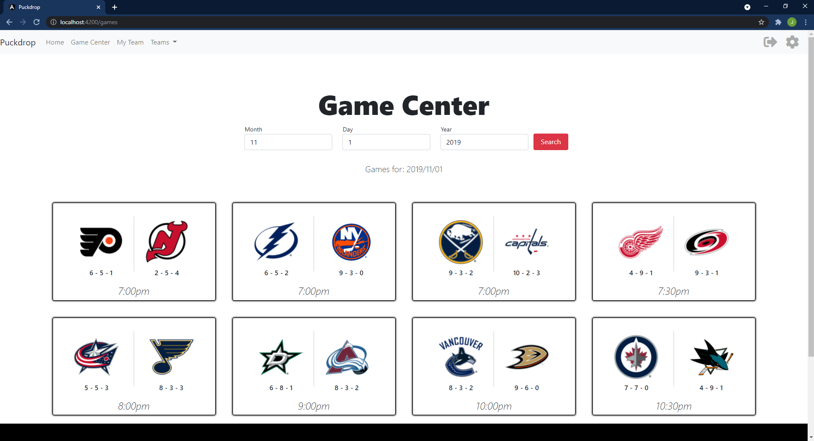

### Game Info
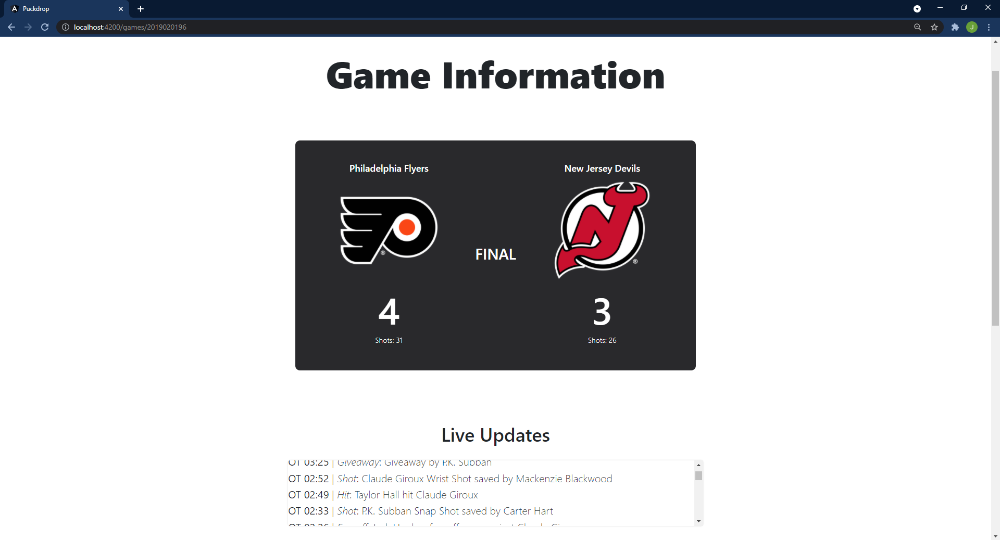
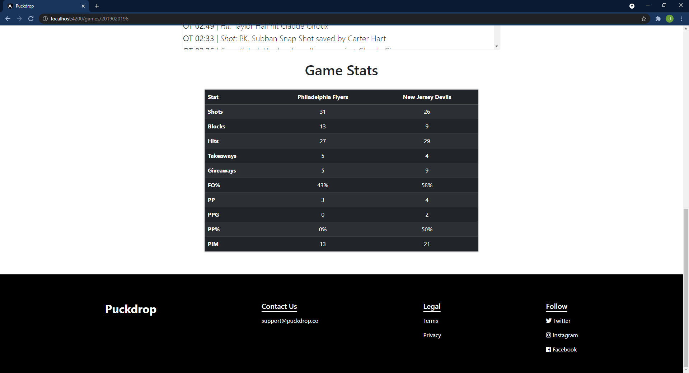

### Comparing Teams
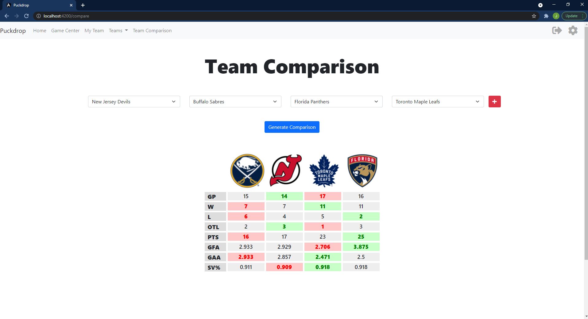

### Team page

### Team roster
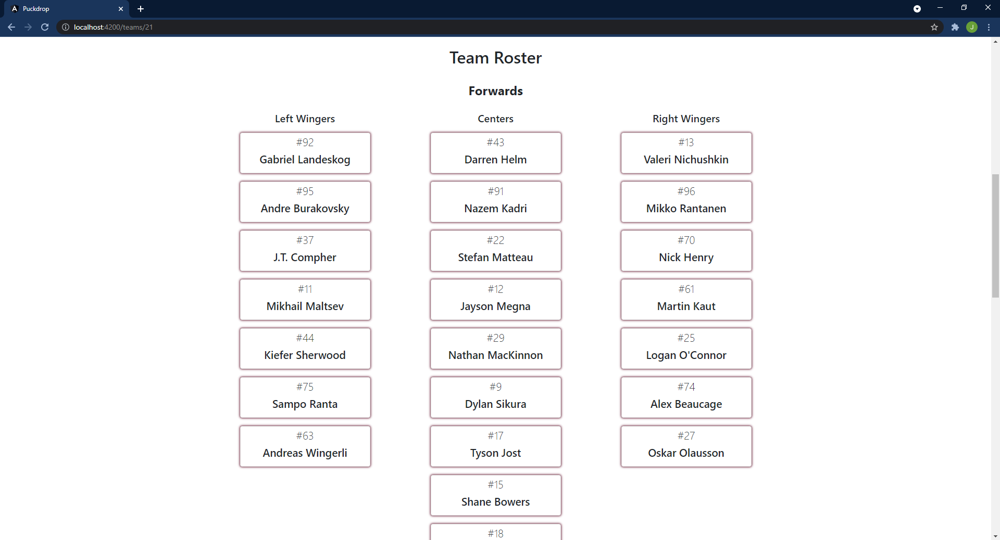

### Player page
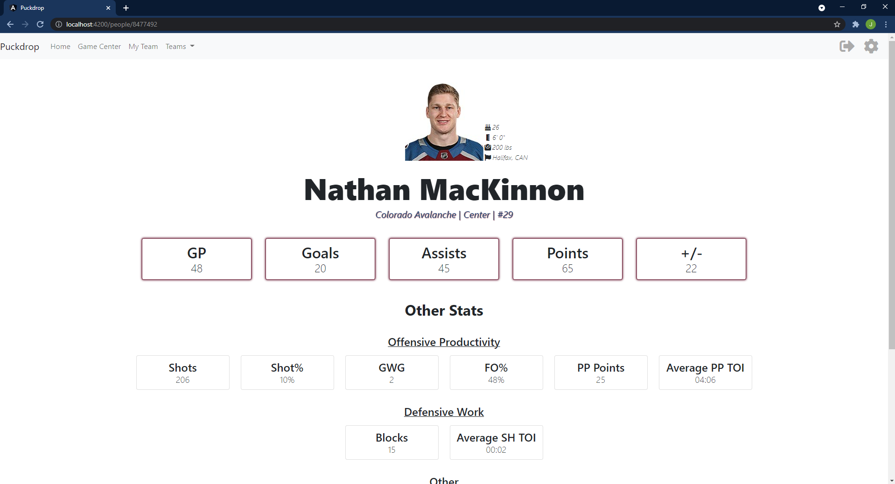

### Team chat
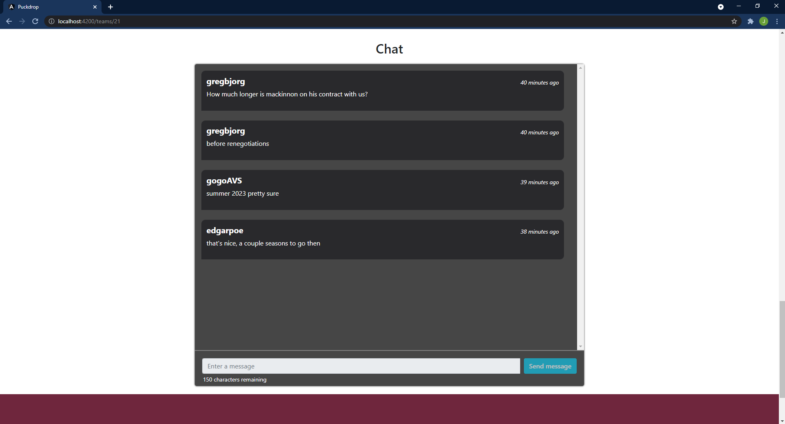

### User settings
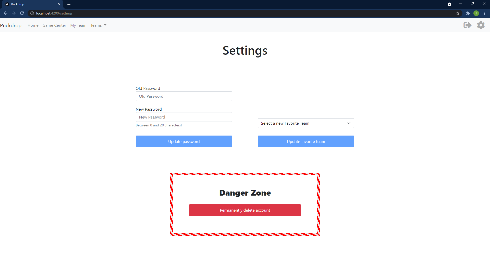
