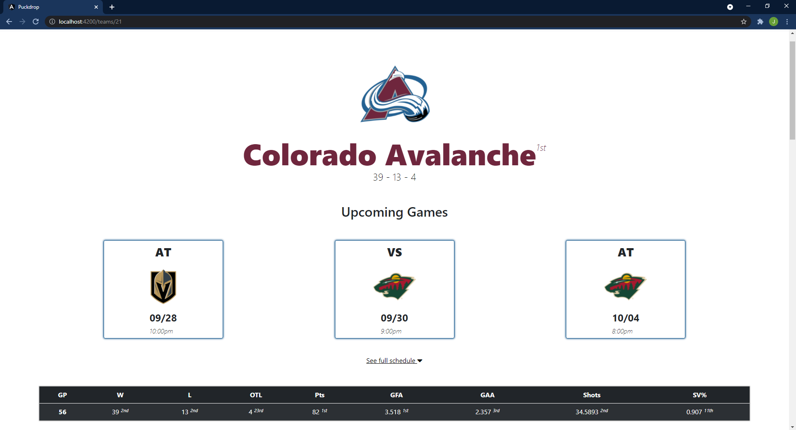

# *Puckdrop*
> NHL rosters, games, chat, standings, and stats

- League & Division standings
- Team performance, ranking, and rosters
- League-wide chat for all
- Team chat (restricted to fans only!)
- Player performance statistics & biographical information
- Game schedule explorer
- Live box score updates

---

## Screens

### Login/Signup

### League Standings

### League Chat

### Game Center

### Game Info

### Comparing Teams

### Team page

### Team roster

### Player page

### Team chat

### User settings

